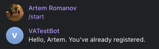
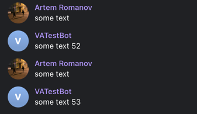

## VA Intelligence test task

*Для запуска БД:*

```
docker-compose --env-file .env up
```

В задании сказано, что нужно запускать приложение с входными аргументами, однако мне было удобнее использовать .env
файл, где прописаны все необходимые значения переменных.  
Я написал небольшой таск для Gradle, который парсит .env файл и передает переменные в конфигурацию запуска.

*Для запуска приложения:*

```
./gradlew bootRun
```

### Примеры работы приложения:




<br>

*запрос updateQueueDelay:*

```
curl -X PUT \
    http://localhost:8080/api/v1/updateQueueDelay \
    -H 'Content-Type: application/json' \
    -d '{
            "newDelay" : 5000
        }'
```

*response:*

```
{
    "new_delay": 5000
}
```  

<br>

*запрос getEchoMessage:*

```
curl -X POST \
    http://localhost:8080/api/v1/receiveEchoMessage \
    -H 'Content-Type: application/json' \
    -d '{
            "message":"message",
            "userSender":258095752
        }'
```
*response:*
```
{
    "message_number": 55,
    "is_ok": true
}
```